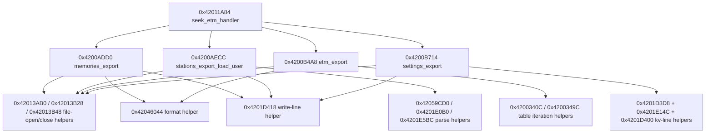

# Action routine call graph (Memories/Stations/ETM-List/Settings)

## Scope

- Dispatch source: `0x42011A84..0x42013523` (SEEK/ETM handler).
- Key mapping into these routines:
- `51` -> `0x4200ADD0` (`Memories`)
- `52` -> `0x4200AECC` (`Stations`)
- `53` -> `0x4200B4A8` (`ETM-List`)
- `54` -> `0x4200B714` (`Settings`)

## Function boundaries

- `0x4200ADD0..0x4200AEC8` (hard end at `retw.n`).
- `0x4200AECC..0x4200B1FC` (hard end at `retw.n`).
- `0x4200B4A8..0x4200B710` (inferred end: branch target at `0x4200B710`, next known entry at `0x4200B714`).
- `0x4200B714..0x4200BD60` (hard end at `retw.n`).

## Per-routine anchors

- `0x4200ADD0`:
- `/memo.txt`
- `9999`
- `%02d,%05d,%d,%d,%d`
- `0x4200AECC`:
- `/stations.txt`
- `%5d,%s`
- `/user.txt`
- `no user stations`
- `Userdata found`
- ` user stations ready.`
- `0x4200B4A8`:
- `/etm.txt`
- `ETM at %02d.%02d.%d - %02d:%02d Local\n`
- `%02d %04X %8s %5d %3d`
- `0x4200B714`:
- `/settings.txt`
- key labels written into output:
- `menu`, `bandwidthSSB`, `bandwidthAM`, `bandwidthFM`, `stepSSB`, `stepAM`, `stepFM`, `mode`, `battery`, `decoder`, `automute`, `band`, `store`, `station`, `volume`, `agcFM`, `agcAM`, `agcSSB`, `softmute`, `bfo`, `frequency`, `backlight`, `tint`, `inverse`, `greyscale`, `home`, `slow`, `seek`

## Callee density (from `action_routines_call_data.txt`)

- `0x4200ADD0` heavy calls:
- `0x4201DF5C` x2, `0x42013AB0` x1, `0x42013B28` x1, `0x42046044` x1, `0x4201D418` x2, `0x4200ADC0` x2
- `0x4200AECC` heavy calls:
- `0x4201DDC4` x12, `0x4201D418` x5, `0x4200ADC0` x4, `0x42013B48` x3, `0x42013B28` x2
- plus parse/load helpers (`0x42059CD0`, `0x4201E8B4`, `0x4201E628`, `0x42003324`)
- `0x4200B4A8` heavy calls:
- `0x4200340C` x4, `0x4200349C` x2, `0x42046044` x2, `0x4201D418` x2, `0x4200ADC0` x2
- `0x4200B714` heavy calls:
- `0x4201D3D8` x28, `0x4201D400` x26, `0x4201E14C` x22, `0x4201DDC4` x29
- pattern strongly indicates repeated key/value line construction into a settings text buffer

## Inferred graph

## Confidence

- High confidence:
- key dispatch targets and three hard function ends (`0x4200AEC8`, `0x4200B1FC`, `0x4200BD60`)
- file/topic mapping for all four routines
- Medium confidence:
- exact endpoint for `0x4200B4A8` (`0x4200B710`) because local data/alignment bytes interleave near the `0x4200B714` entry
- exact semantic names of helper callees (addresses are concrete; names are inferred)
