# SEEK/ETM call graph (0x42011A84..0x42013523)

## Scope

- Binary region: `app0` text segment (`0x42000020` region)
- Primary handler entry: `0x42011A84`
- Next distinct entry after region: `0x42013524`

This region behaves like a large state/input handler for scan/seek/ETM and quick menu actions.

## Top callees inside this handler

From `/Users/beegee/Documents/ats mini/ats-mini-UNLTD/reports/firmware/targetSEEK_recon/seek_etm_call_graph_data.txt`:

- `0x42003100` (26 calls): UI helper primitive (inferred)
- `0x42018128` (22 calls): panel/layout draw helper (inferred)
- `0x4201F614` (20 calls): time/tick read (inferred)
- `0x42019448` (17 calls): text draw helper (inferred)
- `0x4201DDC4` (16 calls): buffer/string utility (inferred)
- `0x4201F630` (16 calls): delay/wait helper (inferred)
- `0x4200D960` (15 calls): screen refresh / mode commit (inferred)

## Key dispatch map (confirmed by comparisons against keycode byte)

Keycode source byte is read around `0x42012D40..0x420132B1` and compared to constants:

- `50` (`0x42012D40`) -> label `Hardcopy` (`0x3C060CC5`) -> action call `0x42003664`, then `0x42003688`
- `51` (`0x42012DB8`) -> label `Memories` (`0x3C060CD0`) -> action call `0x4200ADD0`
- `52` (`0x42012E33`) -> label `Stations` (`0x3C060CDB`) -> action call `0x4200AECC`
- `53` (`0x42012EA8`) -> label `ETM-List` (`0x3C060CE6`) -> action call `0x4200B4A8`
- `54` (`0x42012F26`) -> label `Settings` (`0x3C060CF1`) -> action call `0x4200B714`
- `60` (`0x42013019`) -> label `TINT/Normal` (`0x3C060C3E` / `0x3C060C45`) -> toggle bit then redraw
- `61` (`0x42013134`) -> label `Inverse/Normal` (`0x3C060C5C` / `0x3C060C45`) -> toggle bit then redraw
- `62` (`0x420131C4`) -> label `GreyScale/Color` (`0x3C060C66` / `0x3C060C72`) -> toggle bit then redraw
- `63` (`0x42013257`) -> label `SEEK ON/OFF` (`0x3C060C7A` / `0x3C060C84`) -> toggle bit then redraw
- `66` (`0x42012F9E`) -> label `logfile.txt` pointer (`0x3C0608C5`) -> action call `0x4200CEFC`
- `44` (`0x420130A4`) -> speed label `Fast/Slow` (`0x3C060C4E` / `0x3C060C55`) -> value from `0x4201ECC4`

## Control-flow hotspots

- `0x4201280B`: index arithmetic / dispatch setup (`addx4`) before menu-state logic.
- `0x42012D40..0x420132D7`: dense key action chain (50/51/52/53/54/60/61/62/63/66).
- `0x42012951..0x4201299C`: status line numeric formatting/update path.

## Inferred graph

```mermaid
graph TD
  A["0x42011A84 seek_etm_handler"] --> T["0x4201F614 tick/time"]
  A --> U["0x42003100 ui_helper"]
  A --> P["0x42018128 panel_draw"]
  A --> D["0x42019448 draw_text"]
  A --> W["0x4201F630 delay"]
  A --> R["0x4200D960 refresh"]

  A --> K50["key=50 Hardcopy"]
  A --> K51["key=51 Memories"]
  A --> K52["key=52 Stations"]
  A --> K53["key=53 ETM-List"]
  A --> K54["key=54 Settings"]
  A --> K66["key=66 logfile"]
  A --> K60["key=60 TINT toggle"]
  A --> K61["key=61 Inverse toggle"]
  A --> K62["key=62 GreyScale toggle"]
  A --> K63["key=63 SEEK toggle"]

  K50 --> C50["0x42003664 / 0x42003688"]
  K51 --> C51["0x4200ADD0"]
  K52 --> C52["0x4200AECC"]
  K53 --> C53["0x4200B4A8"]
  K54 --> C54["0x4200B714"]
  K66 --> C66["0x4200CEFC"]
```

## Notes

- Names are inferred from call patterns + nearby string labels.
- Use `SEEK_ETM_PSEUDOCODE.md` as the behavioral outline companion.
